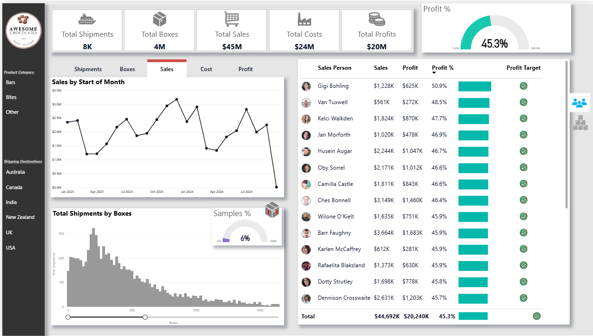

# Sales Analysis Dashboard

## Project Overview
This Sales Analysis Dashboard provides a comprehensive overview of sales for Awesome Chocolate Company from January 2023 to September 2024.
It is designed to help stakeholders monitor key business metrics and analyse sales data to support data-driven decision-making.

## Objectives
- Analyse overall shipments, box counts, sales, costs, and profits  
- Evaluate sales performance by individual salespeople 
- Evaluate product performance by individual products  
- Identify patterns in shipment volumes and box count

## Dataset
The dashboard uses the following datasets:  
- Shipment data  
- Product data  
- Salespeople data  
- Shipping destination (location) data  
- Calendar data  

[Awesome Chocolates Dataset](chocolate-sales-data.xlsx)

## Tools & Technologies
- **Power BI Desktop** – Primary platform for dashboard development  
- **Power Query** – For data cleaning, transformation, and preparation  
- **DAX** – For calculated measures
- **Data Modeling** – Relationships between tables enable cross-filtering and aggregation  

## Key Metrics & KPIs
- **Total Shipments:** 8K  
- **Total Boxes:** 4M  
- **Total Sales:** $45M
- **Total Costs:** $24M
- **Total Profit:** $20M
- **Profit Percentage:** 45.3%  

## Dashboard Features
- KPI cards displaying Total Shipments, Total Boxes, Total Sales, Total Costs, and Total Profits  
- Line chart displaying trends of shipments, boxes, sales, costs, and profits over time  
- Table showing the performance of each salesperson  
- Table showing sales data for each product  
- Histogram displaying shipment volumes by box count  
- Profit target achievement indicators  
- All visuals are interactive and can be filtered by product category, shipping destination, salespeople, product name, and time  

## Key Insights
- The business maintains a strong overall profit margin of **45.3%**  
- **Top 3 most profitable products:** “Peanut Butter Cubes”, “Orange Choco”, “Rich Dark Bites”  
- **Bottom 3 least profitable products:** “Extra Dark Bars”(**37.2% loss**), “Mint Chip Choco”, “Caramel Stuffed Bars”
- All salespeople have met overall profit targets (**40%-51%**)  
- All the countries maintain a similar profit margin (**44%-47%**)  
- The majority of shipments are within the **0–500 box quantity range**  

## Dashboard Preview

- [Screen recording link]  

## How to Use
1. Download the Power BI (.pbix) file - [Download](sales-analysis.pbix)
2. Open that file in Power BI Desktop 
3. Interact with filters and visuals to explore the insights

## Note
This dashboard was built from scratch by me using the dataset. While using concepts from a learning course, all dashboards, measures, and data modeling were implemented independently.

